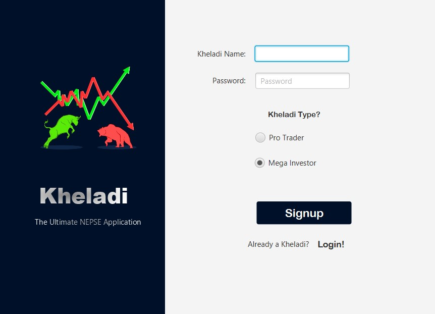
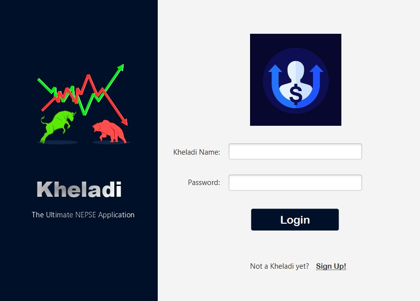
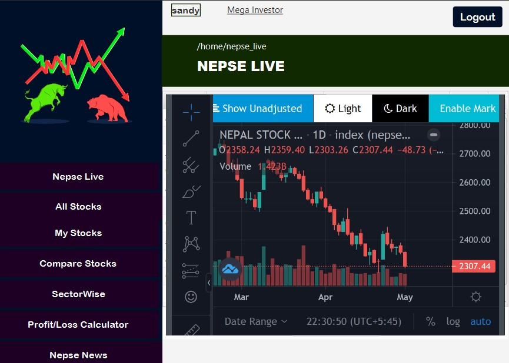
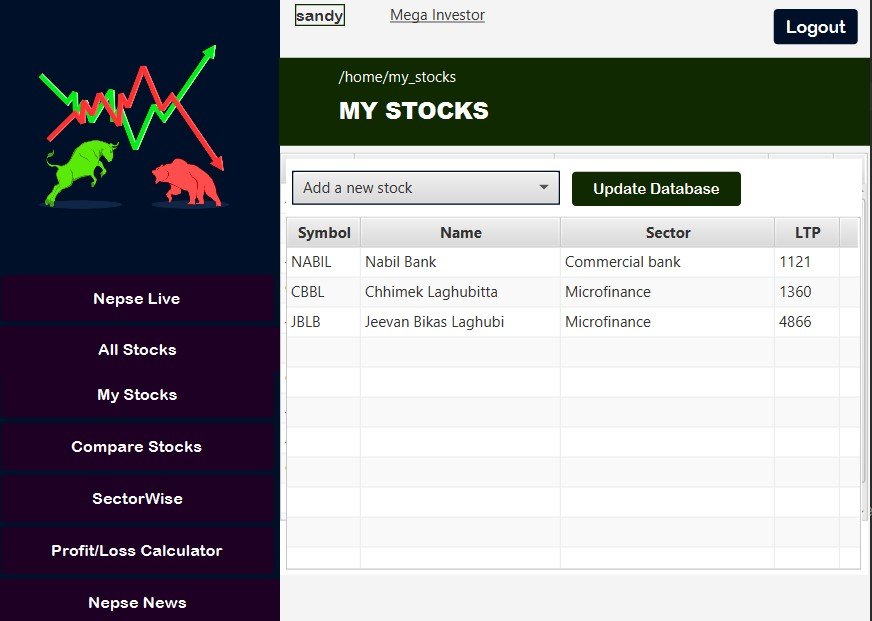
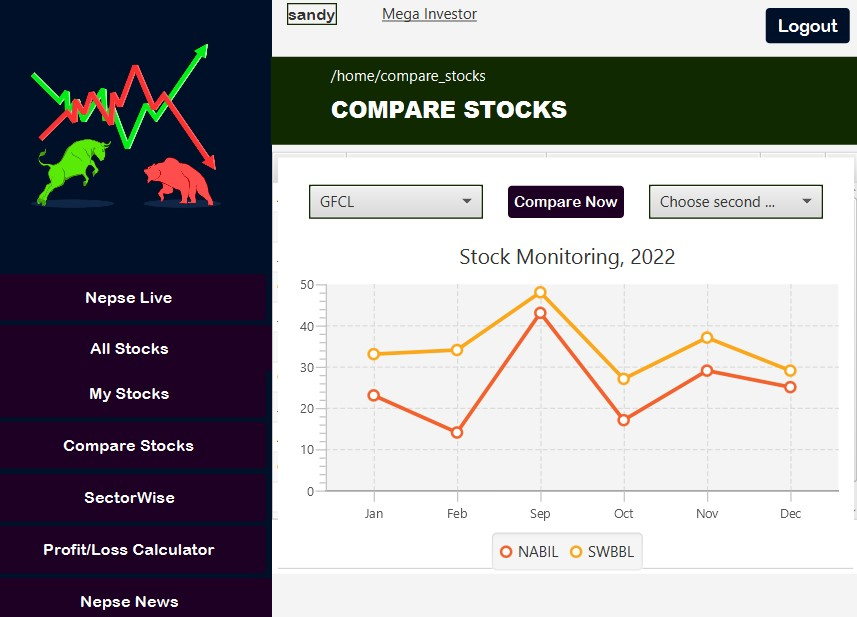
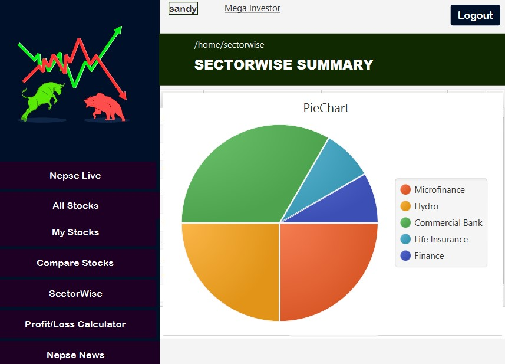
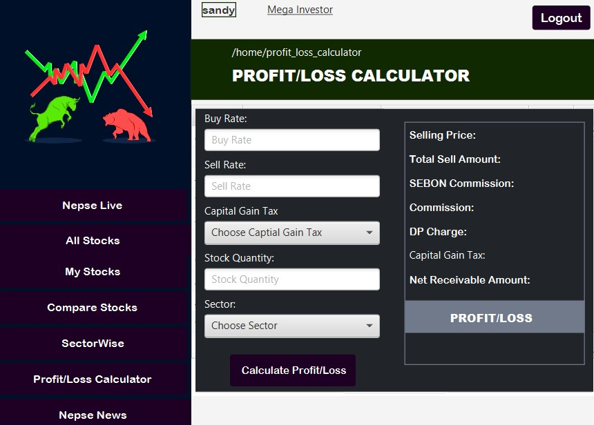

# KHELADI   _The ultimate Nepse Application_

Kheladi is a simple Nepse Applicaion built in Java Programming Language. I built this application only to apply theories of JAVAFX to practice and also as college practical assessment. It is still very crude. Decided to opensource it for anyone willing to apply their learnings of the language and more. 


## Features

- Authentication and Database using PHP/MySql.
- Live Nepse (Webview).
- Nepse Profit/Loss Caluclator.
- Compare stocks.
- Piechart and linechart. 


## Screenshots

           


          
        


        \





## Installation

```sh
- Set up JavaFx in your IDE.
- Create Mysql Database 'Kheladi' with tables 'authentication' and 'stocks'
-

```


